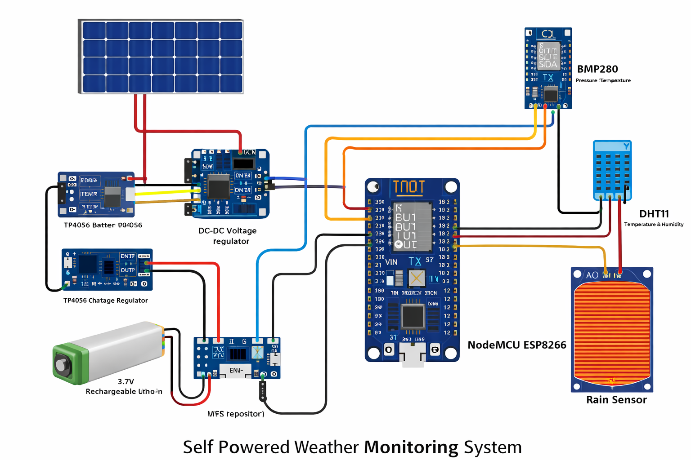

# 🌦 Self Powered IoT Based Weather Monitoring System

## 📌 Project Overview
The Self Powered IoT Based Weather Monitoring System is designed to monitor environmental parameters such as temperature, humidity, atmospheric pressure, and rainfall in real time.  

The system uses **ESP8266 (NodeMCU)** to collect data from multiple sensors and uploads the readings to the **ThingSpeak cloud platform** via Wi-Fi.  

The project is powered using a **solar panel and rechargeable battery**, making it energy-efficient and suitable for remote locations.

---

## 🚀 Features
- Real-time weather monitoring
- Solar-powered system
- Cloud data storage using ThingSpeak
- Wireless data transmission
- Multi-sensor integration
- Low power consumption

---

## 🛠 Components Used
- ESP8266 NodeMCU
- BMP280 Pressure & Temperature Sensor
- DHT11 Temperature & Humidity Sensor
- Rain Sensor Module
- Solar Panel
- 3.7V Rechargeable Li-ion Battery
- TP4056 Charging Module
- DC-DC Voltage Regulator
- Jumper Wires & Breadboard

---

## 🔌 Pin Configuration

### 📍 DHT11
- VCC → 3.3V
- GND → GND
- Data → D4 (GPIO2)

### 📍 BMP280 (I2C)
- VCC → 3.3V
- GND → GND
- SDA → D2 (GPIO4)
- SCL → D1 (GPIO5)

### 📍 Rain Sensor
- AO → A0
- VCC → 3.3V
- GND → GND

---

## ⚙ Working Principle

1. Sensors collect environmental data.
2. ESP8266 processes sensor readings.
3. Device connects to Wi-Fi.
4. Data is uploaded to ThingSpeak cloud.
5. Users can monitor live data from anywhere.

The solar panel charges the battery using a TP4056 charging module.  
The DC-DC regulator ensures stable voltage supply to the NodeMCU and sensors.

---

## ☁ Cloud Platform

- ThingSpeak IoT Platform
- Data uploaded every 20 seconds
- 5 fields used:
  - Field 1 → BMP280 Temperature
  - Field 2 → BMP280 Pressure
  - Field 3 → DHT11 Humidity
  - Field 4 → DHT11 Temperature
  - Field 5 → Rain Sensor Value

---

## 📷 Circuit Diagram

(Add your circuit diagram image here)

Example:
```

```

---

## 💻 Software Used
- Arduino IDE
- Embedded C
- ThingSpeak Cloud

---

## 🌍 Applications
- Smart Agriculture
- Environmental Monitoring
- Weather Stations
- Remote Area Monitoring
- Research & Data Analysis

---

## 👩‍💻 Author
Vennela Narisetty  
B.Tech – Computer Science  
